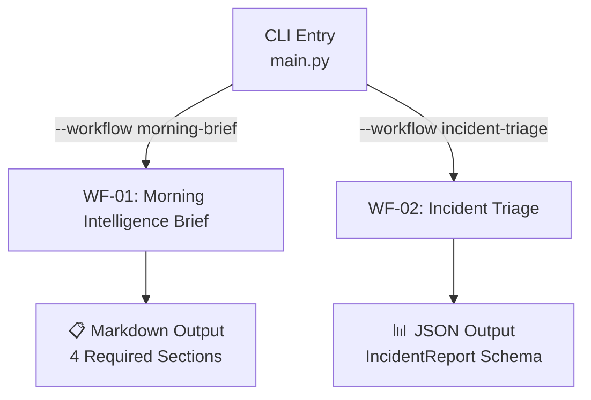
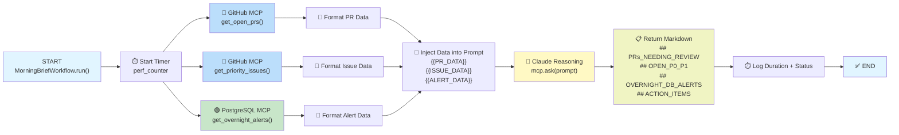
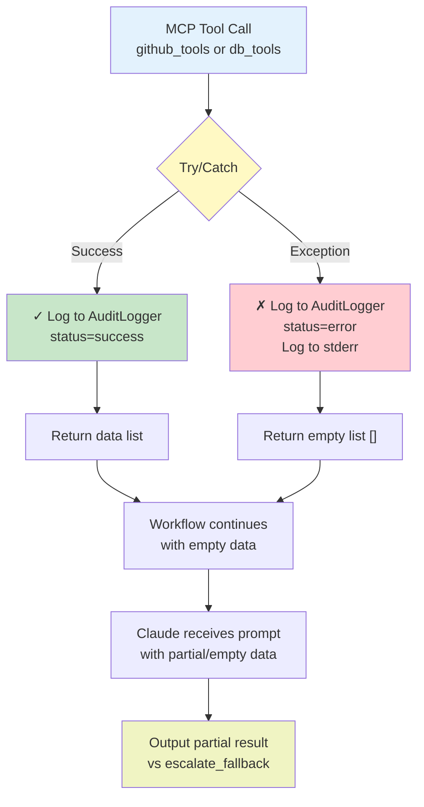
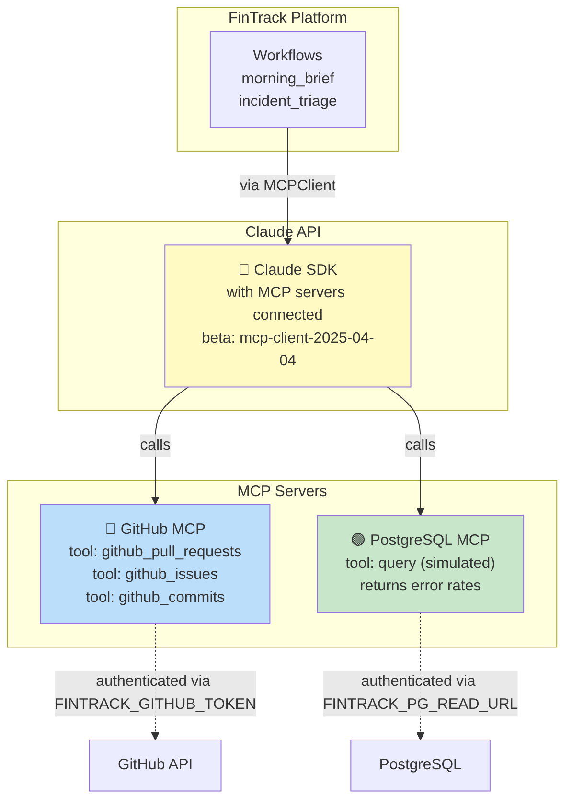

# FinTrack Workflow Architecture

## Workflow Overview



---

## WF-01: Morning Intelligence Brief Workflow

**Trigger:** `python main.py --workflow morning-brief`

**Purpose:** Daily overview of PRs, priority issues, and overnight error alerts



### Data Flow Detail

| Step | Tool Call | Parameters | Returns |
|------|-----------|-----------|---------|
| 1 | `github_pull_requests` | `repo`, `state="open"` | List of open, non-draft PRs |
| 2 | `github_issues` | `repo`, `labels=["P0", "P1"]` | Sorted open issues (P0 first) |
| 3 | `get_overnight_alerts` | (simulated) | Services with elevated error rates |
| 6 | Claude prompt | Formatted PR/issue/alert data | Markdown with 4 section headers |

---

## WF-02: Incident Triage Workflow

**Trigger:** `python main.py --workflow incident-triage --service <name>`

**Purpose:** Real-time diagnosis of service disruptions and escalation decision

```mermaid
graph LR
    START["START<br/>IncidentTriageWorkflow.run()"]
    
    START --> TIMING["⏱️ Start Timer"]
    
    TIMING --> DB_30MIN["🟢 PostgreSQL MCP<br/>get_error_rate()<br/>window=30min"]
    
    DB_30MIN --> GH_COMMITS["🔵 GitHub MCP<br/>search_recent_commits()<br/>hours=4"]
    
    GH_COMMITS --> GH_BUGS["🔵 GitHub MCP<br/>get_priority_issues()<br/>labels=[bug, service]"]
    
    GH_BUGS --> DB_5MIN["🟢 PostgreSQL MCP<br/>get_error_rate()<br/>window=5min<br/>CURRENT SNAPSHOT"]
    
    DB_5MIN --> FORMAT["📝 Format All Data"]
    
    FORMAT --> INJECT["💉 Inject Data into Prompt<br/>{{SERVICE_NAME}}<br/>{{ERROR_RATE_30MIN}}<br/>{{ERROR_RATE_NOW}}<br/>{{RECENT_COMMITS}}<br/>{{OPEN_BUGS}}"]
    
    INJECT --> CLAUDE["🤖 Claude Reasoning<br/>Correlate: Recent deploy?<br/>Sustained or spike?<br/>Recommend action"]
    
    CLAUDE --> PARSE["📊 Parse JSON Response"]
    
    PARSE --> OUTPUT["📊 Return IncidentReport<br/>{<br/>  service, error_rate_now,<br/>  error_rate_30min_avg,<br/>  likely_cause, recent_deploys,<br/>  recommended_action,<br/>  escalate = (now > 3x avg?)<br/>}"]
    
    OUTPUT --> ESCALATE{escalate flag?}
    
    ESCALATE -->|true| PAGE["🚨 PAGE ON-CALL"]
    ESCALATE -->|false| LOG["📋 Log Result"]
    
    PAGE --> END["✅ END"]
    LOG --> END
    
    style START fill:#e1f5ff
    style DB_30MIN fill:#c8e6c9
    style GH_COMMITS fill:#bbdefb
    style GH_BUGS fill:#bbdefb
    style DB_5MIN fill:#c8e6c9
    style CLAUDE fill:#fff9c4
    style OUTPUT fill:#ffccbc
    style PAGE fill:#ffcdd2
    style END fill:#e1f5ff
```



### Data Flow Detail

| Step | Tool Call | Parameters | Returns |
|------|-----------|-----------|---------|
| 1 | `get_error_rate()` | `service`, `window_minutes=30` | Error rate (errors/sec) over 30 min |
| 2 | `github_commits` | `repo`, `path=services/{service}/` | Recent commits in last 4 hours |
| 3 | `github_issues` | `repo`, `labels=["bug", service]` | Open bugs assigned to service |
| 4 | `get_error_rate()` | `service`, `window_minutes=5` | **Current error rate (NOW)** |
| 7 | Claude prompt | All formatted data above | JSON with likely_cause + escalate flag |

### Key Decision Logic

```
if error_rate_now > (error_rate_30min_avg × 3):
    escalate = true      // Page on-call immediately
    recommended_action = "Urgent: error rate spiked 3x baseline"
else:
    escalate = false     // Log for investigation
    recommended_action = "Monitor and investigate"
```

---

## Error Handling Pattern (Graceful Degradation)

Both workflows implement the same resilience pattern:



**Principle:** Tool wrappers never raise exceptions; they log gracefully and return empty data. Workflows continue with partial data. Claude still produces useful output.

---

## MCP Server Connections



---

## Audit Trail

Every MCP tool call is logged to `~/.fintrack/audit.log` (JSONL format):

```json
{
  "timestamp": "2026-05-11T14:32:45.123456+00:00",
  "workflow": "morning_brief",
  "tool": "github_pull_requests",
  "input_hash": "a3f4b2c8d9e1f5a7b3c4d5e6f7a8b9c0d1e2f3a4b5c6d7e8f9a0b1c2d3e4f5",
  "status": "success",
  "duration_ms": 342
}
```

**No PII logged:** Input parameters are hashed (SHA-256) to protect API keys, tokens, and customer data.

---

## Architecture Rules Enforced

1. ✅ **All tokens via env vars only** — No hardcoded credentials
2. ✅ **Every MCP call logged** — Via AuditLogger in each tool wrapper
3. ✅ **No PII in prompts** — Aggregated data only ("3 P0 issues", not names)
4. ✅ **Tool wrappers never raise** — Return [] on error, caller continues
5. ✅ **Workflows extend BaseWorkflow** — Template Method pattern with timing/logging
6. ✅ **Input hashing for audit** — SHA-256 of sorted JSON, never raw values
7. ✅ **Graceful degradation** — Missing data doesn't crash; Claude works with what's available
